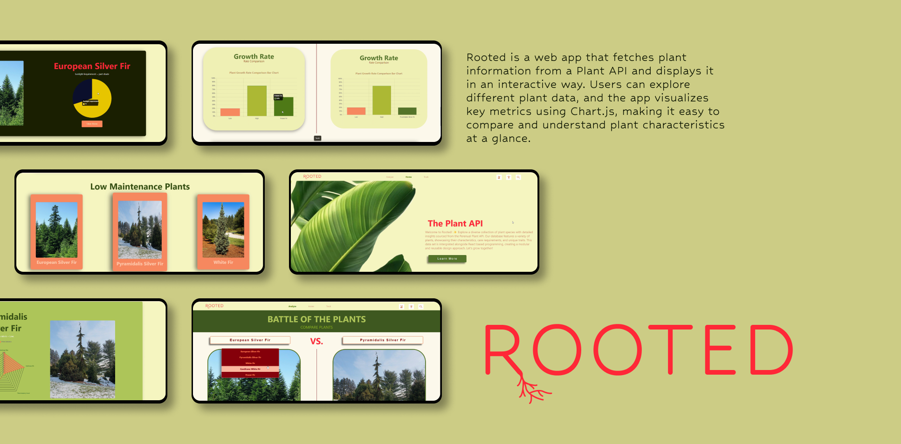
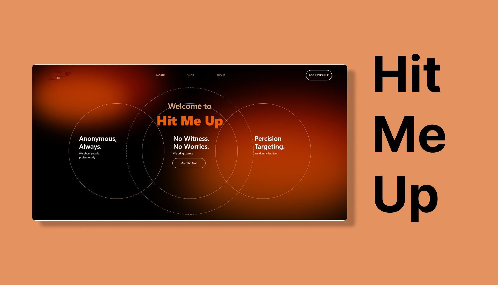
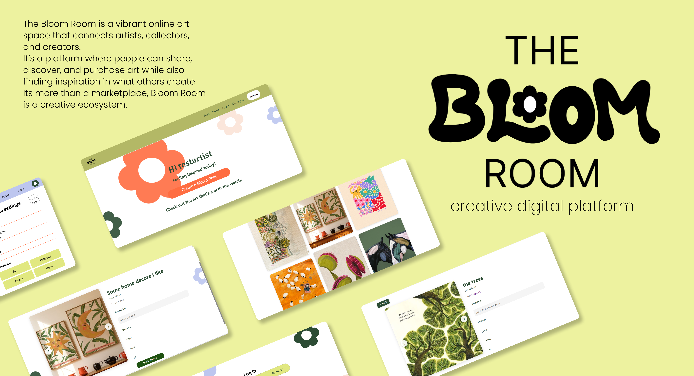
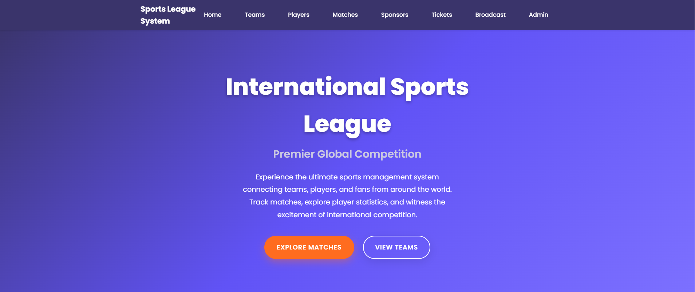

<!-- ================= HEADER IMAGE ================= -->

# Danae Swart – Developer | UI/UX Designer | Artist
Second-Year Development student at Open Window  
Turning ideas into code, solving problems, and bringing creativity to life.  

---
##  About Me

Hi! I'm Danae Swart, a Second-Year Development and UI/UX student at Open Window. I love solving problems with code while integrating my knowledge of UI/UX to create projects that are both functional and visually engaging.

Beyond development, I’m also an artist who paints murals and anything creative that inspires me. I’m a big music lover and enjoy spending quality time with friends and family. 

My work spans web development, UX/UI design, painting, interactive applications, with a focus on crafting solutions that actually work… most of the time  :)

---

### Skills 

| Skill                  | Level       | Proficiency |
|------------------------|------------|------------|
| **UX Design**          | Strongest  | ██████████ 100% |
| **Frontend Development** | Strong     | ████████░░ 75% |
| **Backend Development**  | Competent  | ███████░░░ 70% |
| **Testing**            | Developing | █████░░░░░ 53% |
| **Painting**           | Strong     | █████████░ 90% |
| **Dancing**            | Strong     | ████████░░ 80% |

*Percentages represent relative skill levels, not absolute proficiency.*

---

## Tech Stack

I specialize in **front-end development, back-end integration, and interactive design**. Over the past year, I have contributed to a range of projects, including web applications, API-driven platforms, and fully deployed digital ecosystems, gaining hands-on experience in building functional and cohesive systems from start to finish.

**Languages & Frameworks:**  

**Design & Tools:**  

**Deployment & Hosting:**  

This stack reflects the skills I’ve applied across my **DV200 projects**, including web development apps, API integrations and interactive UI/UX designs
# The journey
####w 2025 Portfolio Projects

# Project 1

  Rooted was created using HTML, CSS, JavaScript and react with dynamic data handling through API calls to fetch plant information. The app uses Chart.js to render interactive charts, allowing users to visualize and compare plant data easily. It’s a lightweight, front-end-focused web application designed for learning and exploring plant characteristics in a clear, visual way.  
  [View Repo](https://github.com/danaeswart/formative-one-rooted-final.git)

# Project 2

  Hit Me Up is a full-stack web application designed as a darkly humorous, fictional platform for exploring the world of an underground hitman-for-hire network. The app demonstrates secure user authentication, dynamic routing, and CRUD operations while presenting a unique, edgy UI/UX. Built with React, Node.js, Express, and MongoDB, the project combines creative design with practical, industry-relevant development practices, making it both a fun and educational showcase of full-stack web development.

  [View Repo](https://github.com/Great-Minds-Technologies/hit-me-up)

# Project 3

Bloom Room is an online platform where art lovers can share, discover, and purchase art, as well as post inspiration for others in the community. The app was designed to connect creators and admirers, offering a space for creativity and collaboration.

The goal of Bloom Room is to provide a user-friendly, interactive, and visually appealing platform that supports artists and enthusiasts alike.

  [View Repo](https://github.com/danaeswart/The-Bloom-Room.git)

---

# Project 4

Sports League System is a comprehensive online platform where sports enthusiasts can explore, track, and manage international football competitions. The system connects teams, players, and fans from around the world, providing detailed match statistics, player profiles, and real-time tournament data. Users can browse teams from different countries, follow live matches, explore player contracts and statistics, and access broadcasting information.

  [View Repo](https://github.com/Onthatile-Lesufi/DV200-Proctored-SQL-Exam.git)

---
##  GitHub Analytics & Activity

### 🔥 GitHub Stats Overview

###  Most Used Languages

### 🏆 GitHub Trophies

###  Contribution Graph

---

### Acknowledgements

I would like to sincerely thank **Open Window** for providing the learning environment and resources that made this project possible.  

Special thanks to my **lecturers** for their guidance, support, and feedback throughout the development of this project.

---

##  Contact Me
- 📧 Email: 241022@virtualwindow.co.za

